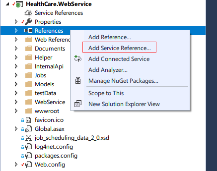
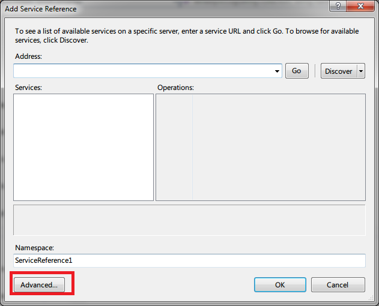
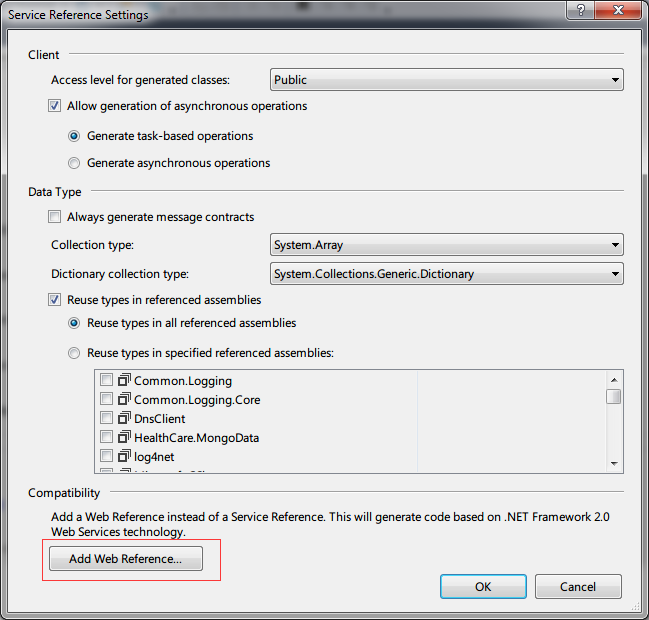
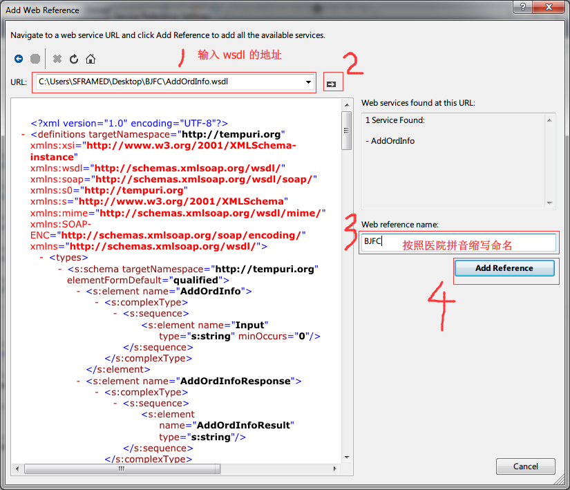
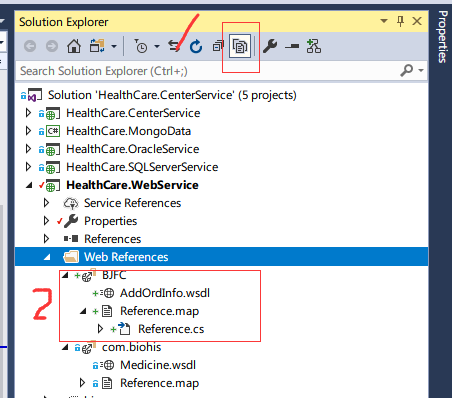

# HealthCare.WebService 项目介绍

> 医院缩写参照 HealthCare.MongoData 中的 SharedServiceModel.cs 文件

## 添加 Service references







## 定义 XML 和 Object 的转换模型

> 添加到 Models 文件夹下, 命名规则为 "医院缩写 + Model.cs"

- 注意 XmlRootAttribute 和 XmlElementAttribute 两个特性的使用

``` XML

<?xml version="1.0" encoding="utf-8"?>
<ROWSET>
  <ROW>
    <!--职工工号-->
    <workNO>4513</workNO>
    <!--职工姓名-->
    <name>小二</name>
    <!--科室代码-->
    <departCode>8201</departCode>
    <!--科室名称-->
    <departName>一病区</departName>
    <!--岗位-->
    <position>护士</position>
  </ROW>
  <ROW>
    <workNO>4514</workNO>
    <name>小三</name>
    <departCode>8201</departCode>
    <departName>一病区</departName>
    <position>护士</position>
  </ROW>
</ROWSET>

```

``` csharp

/// <summary>
///     员工信息
/// </summary>
[XmlRoot("ROWSET")]
public partial class SZGJEmployee
{
    [XmlElement("ROW")]
    public SZGJEmployeeROW[] Employees { get; set; }
}

public partial class SZGJEmployeeROW
{
    /// <summary>
    ///     职工工号
    /// </summary>
    [XmlElement("workNO")]
    public string WorkNO { get; set; }
    /// <summary>
    ///     职工姓名
    /// </summary>
    [XmlElement("name")]
    public string Name { get; set; }
    /// <summary>
    ///     科室代码
    /// </summary>
    [XmlElement("departCode")]
    public string DepartCode { get; set; }
    /// <summary>
    ///     科室名称
    /// </summary>
    [XmlElement("departName")]
    public string DepartName { get; set; }
    /// <summary>
    ///     岗位
    /// </summary>
    [XmlElement("position")]
    public string Position { get; set; }
}

```

## 定义 Converter

> 转换为 SFRA 使用的结构的数据. 代码可参考 "SZGJConverter.cs"

- 添加到 Converters 文件夹下, 命名规则为 "医院缩写 + Converter.cs", 父类修改为 BaseConverter
- Helper 文件夹中的 XmlHelper.cs 中定义了序列化和反序列化 XML 的方法

``` csharp

// 使用如下方式进行 xml 和 object 的转换
var ser = new Serializer();
var data = ser.Deserialize<SZGJEmployee>(xml);

// 所有方法的返回值
public class ConverterResult<T>
{
    public int Code { get; set; }
    public string Message { get; set; }
    public T Data { get; set; }
}

```

### 1. 部门, 病区, 手术室 (Department)

第三方数据源主要提供 唯一标识符 和 名称

``` csharp

new Department
{
    UniqueId = code,                  // 唯一标识符
    DisplayName = name,               // 名称
    Pinyin = name?.Pinyin(),          // 拼音简拼, 如 "第二手术室" 时为 "DESSS"
    PinyinFull = name?.PinyinFull(),  // 拼音全拼, 如 "第二手术室" 时为 "DiErShouShuShi"
    Code = code,                      // 不同于拼音的一种查询数据的方式, 通常值等于 UniqueId
    Filter = nameof(Department),      // 可以直接写为 "Department"; 也可以根据不同类型进行区分, 如部门 "Department", 病区 "ResideArea", 手术室 "Room"
    CreatedTime = DateTime.Now,       // 固定值, 含义为同步数据的时间
    DisplayOrder = -1,                // 可以根据 code 来计算顺序, 也可以写默认值 -1
    IsDisabled = false,               // 一般为固定值 false; 如果名称中包含 "停用", "废除" 等字样的可以考虑赋值为 true
}

```

### 2. 员工 (Employee)

第三方数据源主要提供 工号, 姓名, 职称 和 所属部门; 如果打印红处方时需要医生签名会提供医生的电子签名

``` csharp

new Employee
{
    UniqueId = e.WorkNO,                // 工号, 员工工号为全院唯一
    DisplayName = e.Name,               // 姓名
    Pinyin = e.Name?.Pinyin(),          // 姓名的拼音简拼
    PinyinFull = e.Name?.PinyinFull(),  // 姓名的拼音全拼
    JobNo = e.WorkNO,                   // 工号
    JobTitle = e.Position,              // 职称
    DepartmentId = e.DepartCode,        // 所属部门
    Department = mongo.DepartmentCollection.AsQueryable().FirstOrDefault(f => f.UniqueId == e.DepartCode),  // 冗余数据, 查询数据库获取 Department 对象

    Signature = null,                   // 如果需要电子签名则赋值, 否则赋值为 null
    DisplayOrder = -1,                  // 可以根据工号来计算顺序, 也可以写默认值 -1
    IsDisabled = false,                 // 一般为固定值 false; 如果名称中包含 "停用", "废除" 等字样的可以考虑赋值为 true
    CreatedTime = DateTime.Now,         // 固定值, 含义为同步数据的时间

    // 以下信息不用赋值
    Address = null,
    Age = null,
    Birthday = null,
    CellPhone = null,
    CertificateCode = null,
    CertificateType = null,
    Code = null,
    Email = null,
    Gender = null,
    JobState = null,
    Nation = null,
    Nationality = null,
    Post = null,
}

```

### 3. 物品 (Goods)

> 通常可以包括 药品(Drug), 耗材(MedicalConsume), 手术衣(OperatingCoat), 医用拖鞋(Slipper) 等等

- 第三方数据源主要提供 唯一标识符, 物品名称, 规格, 厂家, 类型, 价格, 包装单位, 使用单位, 包装单位和使用单位的转换率
- 如果是药品信息, 还需要提供 剂量(内服每日用量), 剂型(药物样式)
- 如果是耗材信息, 还需要提供 经销商

``` csharp

new Goods
{
    UniqueId = d.Id,                      // 唯一标识符
    DisplayName = name,                   // 物品名称
    Pinyin = name.Pinyin(),               // 物品名称的拼音简拼
    PinyinFull = name.PinyinFull(),       // 物品名称的拼音全拼
    Code = d.Code,                        // 不同于拼音的一种查询数据的方式, 通常值等于 UniqueId
    Filter = "Drug",                      // 根据不同类型的物品, 给与不同的值. 药品(Drug), 耗材(MedicalConsume), 手术衣(OperatingCoat), 医用拖鞋(Slipper)
    Specification = d.Regu,               // 规格
    Manufacturer = d.Apply,               // 厂家
    GoodsType = d.Type,                   // 类型
    Price = d.OutPrice,                   // 价格
    Dosage = $"{d.Dosage}{d.DosageUnit}", // 药品剂量
    DosageForm = d.DoseType,              // 药品剂型
    IsAmpoule = false,                    // 如果是精麻一类的药品, 可能需要进行空安瓿回收, 此时赋值为 true
    Trader = null,                        // 耗材经销商

    UsedUnit = d.Unit,                                                                                  // 使用单位
    SmallPackageUnit = d.UnitConversions.Where(u => u.Unit != d.Unit).FirstOrDefault()?.Unit ?? null,   // 包装单位
    Conversion = d.UnitConversions.Where(u => u.Unit != d.Unit).FirstOrDefault()?.Conversion ?? 1.0,    // 包装单位和使用单位的转换率

    DisplayOrder = -1,                    // 可以根据唯一标识符来计算顺序, 也可以写默认值 -1
    CreatedTime = DateTime.Now,           // 固定值, 含义为同步数据的时间
    IsSync = true,                        // 固定值 true
    GenericName = null,                   // 通用名 国家定义的名称, 通常仅使用 DisplayName
    TradeName = null,                     // 商品名 各个药厂定义的名称, 通常仅使用 DisplayName
    IsDisabled = false,                   // 一般为固定值 false
    PrescriptionType = null,              // "红处方" 或 "白处方", 如果不需要打印处方则不需要赋值
    Reimburse = null,                     // 医保报销方式, 通常不同赋值
    // PriceSerialNumber = null,
}

```

### 4. 患者 (Patient)

第三方数据源主要提供

``` csharp

new Patient
{
    UniqueId = p.PId,
    DisplayName = p.PatName,
    Pinyin = p.PatName?.Pinyin(),
    PinyinFull = p.PatName?.PinyinFull(),
    Clinic = new Clinic
    {
        UniqueId = p.OutPatientNo,
        SerialNumber = p.OutPatientNo,
        CreatedTime = DateTime.Now,
    },
    Diagnostic = null,
    Hospitalization = new Hospitalization
    {
        UniqueId = p.InPatientNo,
        HospitalNumber = p.InPatientNo,
        ResidedArea = mongo.DepartmentCollection.AsQueryable().FirstOrDefault(f => f.UniqueId == p.PatDepCode),
        ResidedAreaId = p.PatDepCode,
        BedNo = p.BedNo,

        AdmittedDepartment = null,
        AdmittedDepartmentId = null,
        Room = null,
        RoomId = null,
        CreatedTime = DateTime.Now,
        CumulativeCount = 1,
        InitiationTime = DateTime.MinValue,
    },
    Age = DateTime.TryParse(p.DateOfBirth, out DateTime birth) ? DateTime.Now.Year - birth.Year : (int?)null,
    Birthday = birth == DateTime.MinValue ? (DateTime?)null : birth,
    DisplayOrder = int.TryParse(p.InPatientNo, out int order) ? order : -1,
    CreatedTime = DateTime.Now,
    IsDisabled = false,
    RegisterNumber = null,

    CellPhone = null,
    CertificateCode = null,
    CertificateType = null,
    Address = null,
    MedicareNumber = null,
    Nation = null,
    Nationality = null,
    Post = null,
    Code = null,
    Email = null,
    Gender = null,
}

```

### 5. 手术排班 (OperationSchedule)

第三方数据源主要提供

``` csharp

new OperationSchedule
{
    UniqueId = uniqueId,
    PrimaryDoctor = mongo.EmployeeCollection.AsQueryable().FirstOrDefault(e => e.UniqueId == o.os.主刀),
    PrimaryDoctorId = o.os.主刀,
    Patient = patient,
    PatientId = patient.UniqueId,
    RoomId = o.os.roomid.ToString(),
    ApplyTime = date,
    OperationType = o.os.Op_Type,
    DisplayOrder = int.TryParse(o.os.OperatingIndex, out int index) ? index : -1,
    ExecutionBeginTime = o.os.手术开始时间,
    ExecutionEndTime = mongo.OperationScheduleCollection.AsQueryable().Where(x => x.UniqueId == uniqueId).Select(x => x.ExecutionEndTime).FirstOrDefault(), // 手术结束时间以 SFRA 为准
    Remark = o.os.Status,
    IsCancelled = o.os.Status != "已排班",
}

```

### 6. 医嘱 (Prescription)

第三方数据源主要提供

``` csharp

new Prescription
{
    UniqueId = x.DoctorAdviceDetailId,
    DisplayName = $"{p.RecordNo}@{index + 1}",
    TrackNumber = p.RecordNo,
    UsedPurpose = x.Content,
    IsWhole = x.Content.Contains("【带药】"),
    ExchangeBarcode = null,
    Description = null,
    UsedFrequency = null,
    IssuedTime = DateTime.TryParse(x.StartDateTime, out DateTime issue) ? issue : DateTime.MinValue,
    TimeFilter = issue,

    DepartmentSourceId = p.DrugDepCode,
    DepartmentSource = src,
    DepartmentDestinationId = p.PatDepCode,
    DepartmentDestination = dst,
    DoctorId = x.InputDocNum,
    Doctor = mongo.EmployeeCollection.AsQueryable().FirstOrDefault(f => f.UniqueId == x.InputDocNum),
    PatientId = p.PId,
    Patient = mongo.PatientCollection.AsQueryable().FirstOrDefault(f => f.UniqueId == p.PId),
    GoodsId = x.DrugId,
    Goods = goods,
    BatchNumber = string.Empty,
    ExpiredDate = DateTime.MaxValue.Date,
    GoodsBarcodes = new List<string>(),
    Mode = x.Amount > 0 ? ExchangeMode.CheckOut : ExchangeMode.CheckIn,
    Qty = qty,
    // 医生、患者、药品、数量相等且未和 HIS 同步则为先预支后补录的医嘱
    IsAddition = mongo.MedicationCollection.AsQueryable().Any(m => !m.IsDisabled && m.Mode == ExchangeMode.Medication && m.DoctorId == x.InputDocNum && m.PatientId == p.PId && m.GoodsId == x.DrugId && m.QtyActual == qty && m.PrescriptionId == null),
    FeeCollectorId = p.OperNo,
    FeeTime = DateTime.TryParse(p.OperDateTime, out DateTime confirm) ? confirm : DateTime.MinValue,
    FeeType = null,
    FlowRemark = "HIS 已执行",
    FlowState = "HIS 已执行",
    RecordType = "HIS 医嘱",

    QtyActual = 0,
    Plans = null,
    FinishTime = null,
    DispensingTime = null,
    DispensingId = null,

    CustomerId = customer,
    Computer = cus.Select(o => o.Computer).FirstOrDefault(),        // 广济 ———— 部门单主柜
    CreatedTime = DateTime.Now,
    IsDisabled = false,
    DisplayOrder = int.TryParse(x.DoctorAdviceDetailId, out int id) ? id + (index + 1) : -1,

    Agent = null,
    AssignAmpouleRecords = null,
    ChargeOffId = null,
    Deposit = null,
    FinishedAmpoule = false,
    PrintNumber = null,
    PrintRecords = null,
}

```

### 7. 调拨 (Allocation)

第三方数据源主要提供

``` csharp

new Allocation
{
    UniqueId = $"{exchange}@{dpt.UniqueId}",    // 让主键有含义，可避免重复生成
    ExchangeId = exchange,

    ApplyId = applyId,
    ApplyQty = qty,
    DeliveryNumber = applyId,
    DepartmentSourceId = department,
    DepartmentSource = departs.FirstOrDefault(o => o.UniqueId == department),
    DepartmentDestinationId = dpt.UniqueId,
    DepartmentDestination = departs.FirstOrDefault(o => o.UniqueId == dpt.UniqueId),
    GoodsId = find.GoodsId,
    Goods = find.Goods,
    BatchNumber = fill?.BatchNumber ?? string.Empty,
    ExpiredDate = (fill?.ExpiredDate ?? DateTime.MaxValue).Date,
    Mode = ExchangeMode.CheckIn,
    Qty = 0,

    CustomerId = customer,
    Computer = dpt.Computers.FirstOrDefault(),
    RecordType = "SFRA 调拨入库",
    TimeFilter = DateTime.Now.Date,
}

```

## 同步数据

- 和第三方进行同步数据的方式有两种, 一种是调用第三方的接口主动获取, 另一种是被动接收第三方下发的数据
- 如果采用主动获取的方式则把代码添加到 InternalApi/SyncDataInternal.asmx 文件中, 每个方法至少带有一个 hospital 参数, 含义为各个医院的缩写. 根据不同的医院调用不同的接口解析不同的 XML 文件, 如同步物品信息(SyncAllGoods), 同步部门信息(SyncAllDepartments), 同步员工信息(SyncAllEmployees)
- 如果采用被动接收的方式则在 WebService 中添加不同的 asmx 文件, 命名规则为 "医院缩写 + WebService.asmx", 父类修改为 BaseWebService. 如苏州广济医院接收医嘱数据 GuangJiWebService.reciveData(string xml).

**备注** 苏州广济医院上线较早, 并未按照 "医院缩写 + WebService.asmx" 来命名
